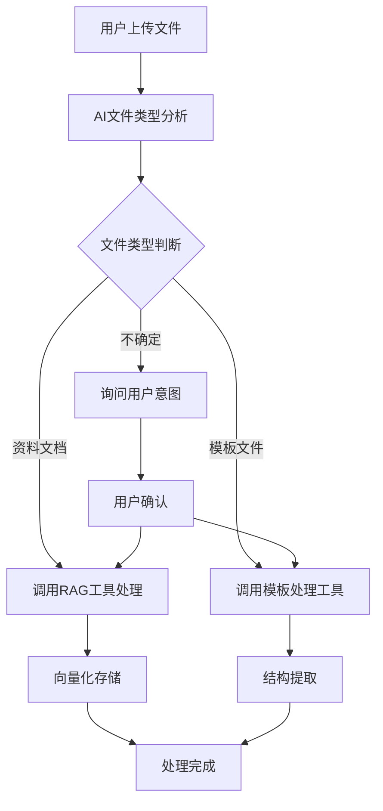
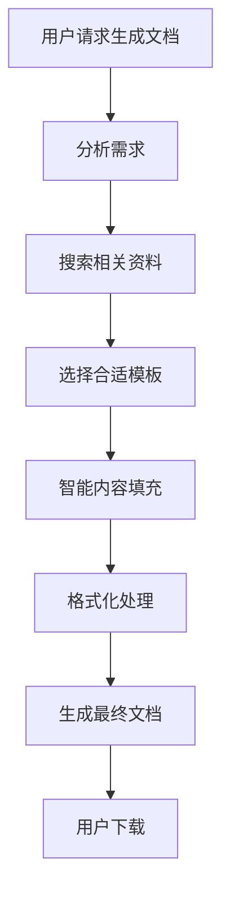
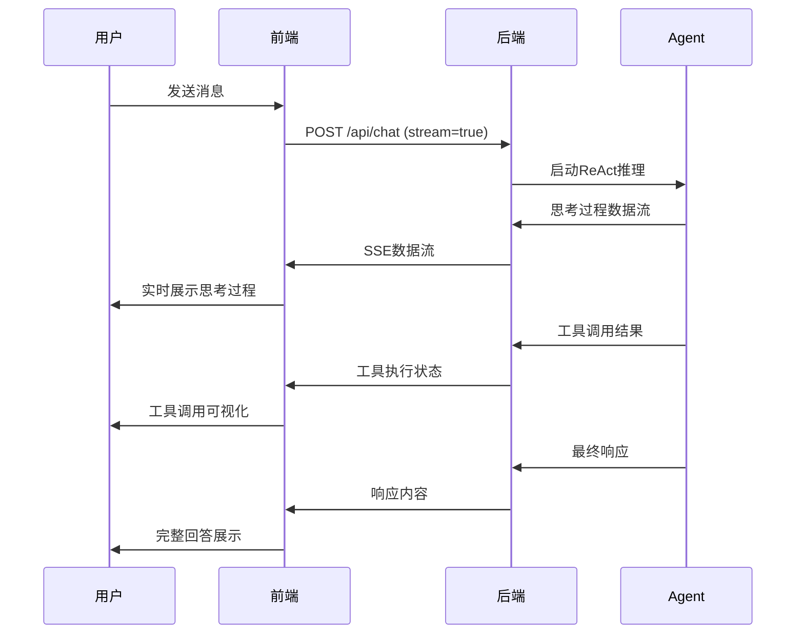

# ReactAgent 系统架构设计文档

## 🏗️ 总体架构概览

ReactAgent 是一个基于ReAct（Reasoning + Acting）模式的智能文档处理系统，采用了现代化的Web架构设计，实现了AI思考过程的可视化展示和智能文档处理工作流。

```
┌─────────────────────────────────────────────────────────────────┐
│                        ReactAgent 系统架构                        │
├─────────────────────────────────────────────────────────────────┤
│  前端层 (Frontend)                                                │
│  ├── 📱 Web界面 (templates/chat.html)                           │
│  ├── 🎨 流式思考过程可视化                                        │
│  ├── 📎 文件上传处理                                             │
│  └── 💬 实时聊天交互                                             │
├─────────────────────────────────────────────────────────────────┤
│  应用层 (Application)                                             │
│  ├── 🌐 Flask Web服务 (web_app.py)                             │
│  ├── 📡 流式响应处理 (Server-Sent Events)                       │
│  ├── 🔄 文件上传管理                                             │
│  └── 🤖 ReAct Agent调度                                         │
├─────────────────────────────────────────────────────────────────┤
│  核心层 (Core)                                                   │
│  ├── 🧠 Enhanced ReAct Agent (src/enhanced_react_agent.py)      │
│  ├── 🔧 核心三工具架构                                           │
│  ├── 💭 思考过程生成与流式输出                                    │
│  └── 🎯 智能工具选择与执行                                        │
├─────────────────────────────────────────────────────────────────┤
│  工具层 (Tools)                                                  │
│  ├── 📚 RAG工具 (rag_tool_chroma.py)                           │
│  ├── 📋 模板处理工具 (template_conversion_tool.py)              │
│  ├── 🤖 模板填充工具 (template_inserter_tool.py)               │
│  └── 🔌 DeepSeek API客户端 (deepseek_client.py)                │
├─────────────────────────────────────────────────────────────────┤
│  存储层 (Storage)                                                │
│  ├── 🗄️ 向量数据库 (ChromaDB)                                   │
│  ├── 📁 文件存储 (uploads/, templates_storage/)                 │
│  ├── 📝 生成文档 (generated_documents/)                         │
│  └── 💾 Agent记忆 (agent_memory.pkl)                           │
└─────────────────────────────────────────────────────────────────┘
```

## 🧠 核心组件详解

### 1. 前端层 (Frontend Layer)

#### 🎨 流式思考过程可视化
- **技术栈**: HTML5 + CSS3 + Vanilla JavaScript
- **核心特性**:
  - 实时思考过程展示，参考Streamlit设计风格
  - 可折叠的思考容器，支持状态变化（思考中→已完成）
  - 工具调用三阶段可视化：调用→执行→结果
  - 15种不同类型的思考步骤，每种都有独特图标和颜色
  - 丰富的CSS动画效果：淡入、闪烁、脉冲、滚动跟随

#### 📱 响应式Web界面
- **设计理念**: 现代化、直观、用户友好
- **核心功能**:
  - 实时聊天交互界面
  - 文件拖拽上传支持
  - 思考过程开关控制
  - 移动端适配优化

### 2. 应用层 (Application Layer)

#### 🌐 Flask Web服务
```python
# 核心路由设计
/                    # 主页面
/api/chat           # 聊天API（支持流式/非流式）
/api/upload         # 文件上传API
/api/clear_memory   # 清空记忆API
```

#### 📡 流式响应架构
- **协议**: Server-Sent Events (SSE)
- **数据类型**:
  ```json
  {
    "type": "thinking|tool_call|content|complete",
    "content": "具体内容",
    "timestamp": "时间戳"
  }
  ```
- **处理流程**: 启动→思考→工具调用→结果→完成→自动折叠

### 3. 核心层 (Core Layer)

#### 🧠 Enhanced ReAct Agent
- **设计模式**: ReAct (Reasoning + Acting)
- **核心能力**:
  - 智能推理与行动决策
  - 流式思考过程生成
  - 多轮对话记忆管理
  - 工具调用策略优化

#### 🎯 智能工具选择
```python
# 工具选择逻辑
def select_tools(user_input, file_context):
    if is_template_file(file_context):
        return ["template_conversion_tool", "template_inserter_tool"]
    elif is_material_file(file_context):
        return ["rag_tool_chroma"]
    else:
        return analyze_intent(user_input)
```

### 4. 工具层 (Tools Layer)

#### 🔧 核心三工具架构

##### 📚 RAG工具 (rag_tool_chroma.py)
- **功能**: 文档embedding处理和智能搜索
- **技术栈**: ChromaDB + 向量化模型
- **核心方法**:
  - `process_document()`: 文档处理与向量化
  - `search_documents()`: 语义搜索
  - `get_storage_info()`: 存储状态查询

##### 📋 模板处理工具 (template_conversion_tool.py)
- **功能**: 模板字段提取和结构分析
- **支持格式**: .docx, .doc, .pdf
- **核心方法**:
  - `extract_template_structure()`: 模板结构提取
  - `identify_placeholders()`: 占位符识别
  - `convert_template()`: 模板格式转换

##### 🤖 模板填充工具 (template_inserter_tool.py)
- **功能**: 智能内容填充和文档生成
- **核心方法**:
  - `fill_template()`: 模板内容填充
  - `generate_document()`: 最终文档生成
  - `format_output()`: 格式化输出

### 5. 存储层 (Storage Layer)

#### 🗄️ 数据存储架构
```
ReactAgent/
├── rag_storage/           # 向量数据库存储
│   ├── chroma.sqlite3     # ChromaDB数据文件
│   └── collections/       # 向量集合数据
├── uploads/              # 用户上传文件
├── templates_storage/    # 模板文件存储
├── generated_documents/  # 生成的文档
└── agent_memory.pkl     # Agent记忆存储
```

## 🔄 工作流程设计

### 1. 智能文件识别流程


### 2. 文档生成流程


### 3. 流式思考过程


## 🎯 技术特色与创新

### 1. 流式思考过程可视化
- **创新点**: 首次实现AI思考过程的实时、美观展示
- **技术亮点**: 
  - 参考Streamlit设计理念
  - 支持多种思考类型的差异化展示
  - 自动折叠与状态管理
  - 工具调用三阶段可视化

### 2. 智能文档处理工作流
- **创新点**: AI自动识别文件类型并选择处理策略
- **技术亮点**:
  - 核心三工具架构设计
  - 智能工具选择算法
  - 端到端文档处理流程

### 3. 现代化Web架构
- **技术特色**:
  - 前后端分离设计
  - 流式响应优化
  - 响应式用户界面
  - RESTful API设计

## 🚀 性能优化

### 1. 前端优化
- **并行处理**: 多个工具调用并行执行
- **流式渲染**: 实时展示思考过程，减少等待时间
- **缓存策略**: 静态资源缓存优化
- **响应式设计**: 移动端性能优化

### 2. 后端优化
- **异步处理**: Flask异步路由处理
- **内存管理**: Agent记忆持久化存储
- **错误处理**: 完善的异常处理机制
- **API限流**: 防止API滥用

### 3. 存储优化
- **向量数据库**: ChromaDB高效向量存储
- **文件管理**: 智能文件清理机制
- **数据压缩**: 文档存储压缩优化

## 📈 扩展性设计

### 1. 工具扩展
- **插件化架构**: 支持新工具的快速集成
- **标准接口**: 统一的工具调用接口
- **配置管理**: 灵活的工具配置系统

### 2. 模型扩展
- **多模型支持**: 支持不同的LLM模型
- **模型切换**: 动态模型选择机制
- **性能监控**: 模型性能实时监控

### 3. 功能扩展
- **多语言支持**: 国际化框架设计
- **用户系统**: 多用户权限管理
- **云部署**: 容器化部署支持

## 🔒 安全性设计

### 1. 文件安全
- **文件类型检查**: 严格的文件类型验证
- **大小限制**: 文件上传大小限制
- **病毒扫描**: 文件安全检查机制

### 2. API安全
- **输入验证**: 严格的输入参数验证
- **错误处理**: 安全的错误信息返回
- **访问控制**: API访问频率限制

### 3. 数据安全
- **敏感信息**: 敏感数据加密存储
- **访问日志**: 完整的访问日志记录
- **备份策略**: 数据备份与恢复机制

## 📊 监控与维护

### 1. 系统监控
- **性能指标**: 响应时间、并发数、错误率
- **资源监控**: CPU、内存、磁盘使用情况
- **日志分析**: 结构化日志分析

### 2. 用户体验监控
- **交互分析**: 用户行为数据分析
- **错误追踪**: 前端错误自动上报
- **性能优化**: 基于数据的性能优化

### 3. 维护策略
- **自动化部署**: CI/CD流水线
- **版本管理**: 语义化版本控制
- **文档维护**: 技术文档持续更新

---

## 🎉 总结

ReactAgent系统采用了现代化的分层架构设计，实现了AI思考过程的可视化展示和智能文档处理工作流。系统具有以下核心优势：

1. **创新的用户体验**: 首次实现AI思考过程的实时可视化展示
2. **智能化工作流**: 端到端的文档处理自动化流程
3. **现代化架构**: 可扩展、高性能的系统设计
4. **完善的工具生态**: 核心三工具架构满足主要文档处理需求

系统不仅提供了强大的功能，更重要的是让用户能够真正理解AI的思考和解决问题的过程，为AI与人类的协作提供了新的范式。 